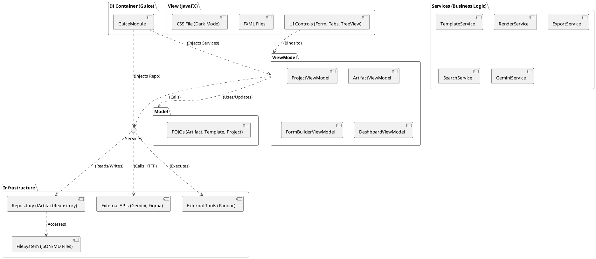

# Architecture Description: Requirements Management System (RMS)

## 1. Tổng quan Kiến trúc (Architectural Overview)

Kiến trúc của RMS được thiết kế như một ứng dụng desktop **đa nền tảng (Cross-platform)**, **ưu tiên lưu trữ local (Local-first)**, và **tập trung vào khả năng tùy biến (Customizable)**.

Mô hình kiến trúc cốt lõi được chọn là **Model-View-ViewModel (MVVM)**, kết hợp với các nguyên tắc **SOLID** và **Dependency Injection (DI)** để đảm bảo một hệ thống dễ bảo trì, dễ mở rộng và dễ kiểm thử.

### 1.1. Công nghệ Cốt lõi (Core Technology Stack)
* **Ngôn ngữ:** Java (JDK 17+).
* **UI Framework:** JavaFX (OpenJFX 17+).
* **Styling:** JavaFX CSS (với file CSS bên ngoài).
* **Dependency Injection:** Google Guice (hoặc Spring Boot nếu cần mở rộng).
* **Data Serialization:** Jackson (dành cho `.json`).
* **Excel Handling:** Apache POI.
* **Diagram Rendering:** PlantUML (thư viện `.jar` Java).
* **Document Conversion:** Pandoc (CLI tool, cài đặt bên ngoài).

### 1.2. Sơ đồ Thành phần Cấp cao (High-Level Component Diagram)

Đây là bức tranh tổng thể về cách các thành phần chính tương tác với nhau.

## 2. Phân rã Kiến trúc (Architectural Breakdown)

### 2.1. Lớp Model (Data Layer)
* **Mục đích:** Đại diện cho dữ liệu thuần túy của ứng dụng.
* **Triển khai:**
    * Đây là các lớp **POJO** (Plain Old Java Object) đơn giản.
    * Ví dụ: `Artifact.java`, `ArtifactTemplate.java`, `ProjectConfig.java`.
    * Các lớp Model **KHÔNG** chứa bất kỳ logic JavaFX nào (không `StringProperty`).
    * Chúng sử dụng các annotation của **Jackson** (ví dụ: `@JsonProperty`) để ánh xạ (map) trực tiếp với các file `.json` trên ổ đĩa.

### 2.2. Lớp View (Presentation Layer)
* **Mục đích:** Chịu trách nhiệm hiển thị UI và nhận tương tác (input) từ người dùng.
* **Triển khai:**
    * **FXML:** Sử dụng FXML để định nghĩa cấu trúc của UI một cách khai báo (declarative). Điều này tách biệt hoàn toàn thiết kế giao diện khỏi logic nghiệp vụ.
    * **View Controllers:** Mỗi file FXML sẽ có một lớp Controller đi kèm. Lớp Controller này được giữ ở mức "câm" (dumb) nhất có thể. Nhiệm vụ duy nhất của nó là:
        1.  Tiêm (inject) `ViewModel` tương ứng vào.
        2.  Thực hiện các liên kết (binding) 2 chiều (bi-directional) giữa các control FXML (ví dụ: `TextField.textProperty()`) và các thuộc tính JavaFX (ví dụ: `viewModel.nameProperty()`).
        3.  Gọi các hàm (commands) trên `ViewModel` khi có sự kiện (ví dụ: `onSaveButtonClick() { viewModel.save(); }`).
    * **Bố cục (Layout):** Sử dụng `BorderPane` cho bố cục 3 cột (IntelliJ-like) và `TabPane` cho khu vực làm việc chính.
    * **Styling:** Giao diện được áp (style) bằng một file `dark-theme.css` bên ngoài, được tải lúc khởi động.

### 2.3. Lớp ViewModel (Presentation Logic)
* **Mục đích:** "Bộ não" của View. Đây là lớp trung gian, tuân thủ MVVM.
* **Triển khai:**
    * **JavaFX Properties:** Lớp ViewModel sẽ "bọc" (wrap) các thuộc tính của Model bằng các JavaFX Properties (ví dụ: `StringProperty`, `ObjectProperty<List<Step>>`, `BooleanProperty`). View sẽ bind trực tiếp vào các Properties này.
    * **Không phụ thuộc View:** ViewModel **KHÔNG** có bất kỳ tham chiếu nào đến các control JavaFX (không `import javafx.scene.control.TextField`). Nó chỉ "phơi bày" (expose) dữ liệu và các hành động.
    * **Logic UI:** Chứa tất cả logic của UI (ví dụ: logic enable/disable một nút bấm, logic xác thực (validation) dữ liệu Form).
    * **Gọi Services:** Khi cần thực hiện một hành động nghiệp vụ (ví dụ: "Lưu", "Tạo sơ đồ"), ViewModel sẽ gọi (call) các lớp Service đã được tiêm (inject) vào nó.
    * Ví dụ: `ArtifactViewModel` sẽ gọi `RenderService.generateDiagram()` và gán kết quả (`BufferedImage`) vào một `ObjectProperty<Image>` mà `ImageView` trong View đang bind tới.

---

## 3. Các Service Nghiệp vụ (Business Services)

Đây là các lớp Singleton (quản lý bởi Guice) chứa logic nghiệp vụ cốt lõi, tuân thủ **Nguyên tắc Trách nhiệm Đơn (Single Responsibility Principle - SRP)**.

* **`ProjectService`:**
    * Xử lý logic của `UC-PM-01` (Tạo dự án) và `UC-PM-02` (Mở dự án).
    * Quản lý file cấu hình `project.json` (ví dụ: danh sách Releases, cấu hình API keys).

* **`TemplateService` (Cốt lõi):**
    * Xử lý logic của `UC-CFG-01` (Form Builder) và `UC-CFG-03` (Export Template Builder).
    * Chịu trách nhiệm đọc/ghi các file cấu hình template (ví dụ: `uc.template.json`, `srs_template_1.json`) từ thư mục `.config`.

* **`RenderService` (Cốt lõi):**
    * **`FormRenderer`:** Một phần của service này, chịu trách nhiệm đọc một file template (`.json`) và **tự động sinh (dynamically render) ra các control JavaFX** tương ứng để hiển thị "Form View".
    * **`DiagramRenderer`:** Xử lý `UC-MOD-01`. Nhận dữ liệu `Flow Builder` (từ `ArtifactViewModel`), **tự động tạo (generate) ra code PlantUML** (string), gọi thư viện PlantUML (`.jar`) để render, và trả về một `BufferedImage`.

* **`SearchService` / `LinkService`:**
    * Xử lý `UC-DEV-02`.
    * Xây dựng và duy trì một chỉ mục (index) trong bộ nhớ của tất cả các artifact (`@ID`) trong dự án để cung cấp chức năng autocomplete (`@`) siêu nhanh.
    * Xây dựng chỉ mục "Backlinks" và cung cấp dữ liệu (Nodes/Edges) cho "Project Graph" (`UC-MOD-02`).

* **`ExportService`:**
    * Xử lý `UC-PUB-01` và `UC-PUB-02`.
    * Sử dụng **Apache POI** để tạo file Excel.
    * Sử dụng **Pandoc** (thông qua `ProcessBuilder` của Java) để thực thi chuyển đổi Markdown -> PDF/DOCX.

* **`ApiService` (hoặc `GeminiService`, `FigmaService`):**
    * Sử dụng `java.net.http.HttpClient` (Java 11+) để thực hiện các lệnh gọi HTTPS bất đồng bộ (asynchronous) đến các API của Gemini và Figma.

---

## 4. Lớp Truy cập Dữ liệu (Data Access Layer - Repository)

Để tuân thủ **Nguyên tắc Đảo ngược Phụ thuộc (Dependency Inversion Principle - DIP)**, các Service sẽ không truy cập file trực tiếp. Chúng sẽ tương tác qua một `interface`.

* **`IArtifactRepository` (Interface):**
    * Định nghĩa các phương thức trừu tượng: `save(Artifact artifact)`, `load(String id)`, `getAll(String artifactType)`, `delete(String id)`.
* **`JsonFileRepository` (Implementation):**
    * Là lớp triển khai (implement) của `IArtifactRepository`.
    * Sử dụng thư viện **Jackson** để serialize/deserialize các đối tượng Model (POJO) thành các file `.json` trên ổ đĩa.
    * **Logic "Kép" (Dual-write):** Khi `save(Artifact artifact)` được gọi:
        1.  **Serialize** đối tượng `artifact` thành file `[ID].json` (Đây là Source of Truth).
        2.  **Tự động generate** một phiên bản Markdown (file `[ID].md`) từ đối tượng đó (Đây là Git-friendly mirror).

---

## 5. Quản lý Đa cửa sổ & Đa luồng (Windowing & Concurrency)

* **Đa cửa sổ (Multi-window):**
    * Một lớp `StageManager` (Singleton) sẽ quản lý việc tạo và hiển thị các `Stage` (cửa sổ) mới.
    * Khi BA kéo một `Tab` ra, `StageManager` sẽ tạo một `Stage` mới, gắn `Scene` của Tab đó vào, và hiển thị nó.
* **Đa luồng (Concurrency - NFR):**
    * **UI Thread:** Mọi cập nhật giao diện PHẢI chạy trên **JavaFX Application Thread**.
    * **Background Threads:** Tất cả các tác vụ nặng, tốn thời gian (I/O file, gọi API, render sơ đồ, xuất bản) PHẢI được thực thi trên một luồng nền (background thread).
    * **Triển khai:** Sử dụng các lớp `javafx.concurrent.Task` và `javafx.concurrent.Service`. Các lớp này cho phép thực thi logic nặng ở nền (`call()`) và sau đó cập nhật kết quả (ví dụ: `updateProgress()`, `succeeded()`) một cách an toàn trên UI Thread.
    * **Auto-save:** Sử dụng `PauseTransition` (JavaFX) để kích hoạt logic lưu (trên luồng nền) sau khi người dùng dừng gõ 1-2 giây.