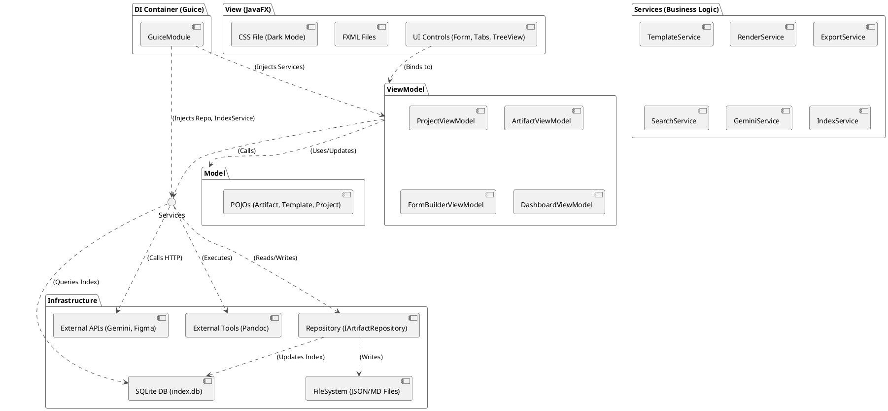

# Architecture Description: Requirements Management System (RMS)

## 1. Tổng quan Kiến trúc (Architectural Overview)

Kiến trúc của RMS được thiết kế như một ứng dụng desktop **đa nền tảng (Cross-platform)**, **ưu tiên lưu trữ local (Local-first)**, và **tập trung vào khả năng tùy biến (Customizable)**.

Mô hình kiến trúc cốt lõi được chọn là **Model-View-ViewModel (MVVM)**, kết hợp với các nguyên tắc **SOLID** và **Dependency Injection (DI)** để đảm bảo một hệ thống dễ bảo trì, dễ mở rộng và dễ kiểm thử.

### 1.1. Công nghệ Cốt lõi (Core Technology Stack)
* **Ngôn ngữ:** Java (JDK 17+).
* **UI Framework:** JavaFX (OpenJFX 17+).
* **Styling:** JavaFX CSS (với file CSS bên ngoài).
* **Dependency Injection:** Google Guice.
* **Data Serialization:** Jackson (dành cho `.json`).
* **Database (Index):** SQLite (thông qua `sqlite-jdbc`).
* **Excel Handling:** Apache POI.
* **Diagram Rendering:** PlantUML (thư viện `.jar` Java).
* **Document Conversion:** Pandoc (CLI tool, cài đặt bên ngoài).

### 1.2. Sơ đồ Thành phần Cấp cao (High-Level Component Diagram)

## 2. Phân rã Kiến trúc (Architectural Breakdown)

### 2.1. Lớp Model (Data Layer)
* **Mục đích:** Đại diện cho dữ liệu thuần túy của ứng dụng.
* **Triển khai:**
    * Đây là các lớp **POJO** (Plain Old Java Object) đơn giản.
    * Ví dụ: `Artifact.java`, `ArtifactTemplate.java`, `ProjectConfig.java`.
    * Các lớp Model **KHÔNG** chứa bất kỳ logic JavaFX nào (không `StringProperty`).
    * Chúng sử dụng các annotation của **Jackson** (ví dụ: `@JsonProperty`) để ánh xạ (map) trực tiếp với các file `.json` trên ổ đĩa.

### 2.2. Lớp View (Presentation Layer)
* **Mục đích:** Chịu trách nhiệm hiển thị UI và nhận tương tác (input) từ người dùng.
* **Triển khai:**
    * **FXML:** Sử dụng FXML để định nghĩa cấu trúc của UI một cách khai báo (declarative).
    * **View Controllers:** Các lớp Controller "câm" (dumb). Nhiệm vụ duy nhất là:
        1.  Tiêm (inject) `ViewModel`.
        2.  Thực hiện các liên kết (binding) 2 chiều (bi-directional) giữa control FXML và thuộc tính JavaFX.
        3.  Gọi các hàm (commands) trên `ViewModel` khi có sự kiện.
    * **Bố cục (Layout):** `BorderPane` (3 cột), `TabPane` (khu vực làm việc).
    * **Styling:** `dark-theme.css` bên ngoài.

### 2.3. Lớp ViewModel (Presentation Logic)
* **Mục đích:** "Bộ não" của View, tuân thủ MVVM.
* **Triển khai:**
    * **JavaFX Properties:** Bọc (wrap) các thuộc tính Model bằng JavaFX Properties (`StringProperty`, `ObjectProperty`).
    * **Không phụ thuộc View:** ViewModel **KHÔNG** import `javafx.scene.control.*`.
    * **Logic UI:** Chứa logic validation, logic trạng thái (enable/disable nút).
    * **Gọi Services:** Khi cần thực hiện nghiệp vụ, ViewModel sẽ gọi các Service đã được inject.
    * *Ví dụ:* `ArtifactViewModel` gọi `RenderService.generateDiagram()`.

---

## 3. Các Service Nghiệp vụ (Business Services)

Các lớp Singleton (quản lý bởi Guice) chứa logic nghiệp vụ cốt lõi, tuân thủ SRP.

* **`ProjectService`:**
    * Xử lý `UC-PM-01` (Tạo dự án), `UC-PM-02` (Mở dự án).
    * Khi mở dự án, PHẢI gọi `IndexService.validateAndRebuildIndex()` để đảm bảo tính toàn vẹn.
    * Quản lý file cấu hình `project.json`.

* **`TemplateService` (Cốt lõi):**
    * Xử lý `UC-CFG-01` (Form Builder) và `UC-CFG-03` (Export Template Builder).
    * Đọc/Ghi các file `.template.json` từ thư mục `.config`.

* **`RenderService` (Cốt lõi):**
    * **`FormRenderer`:** Đọc file template `.json` và **tự động sinh (render) control JavaFX** cho "Form View".
    * **`DiagramRenderer`:** Xử lý `UC-MOD-01`. Nhận dữ liệu `Flow Builder`, **tự động sinh code PlantUML**, gọi thư viện PlantUML (`.jar`) để render, và trả về `BufferedImage`.

* **`IndexService` (Mới - Cốt lõi):**
    * Chịu trách nhiệm quản lý file `index.db` (SQLite).
    * Cung cấp hàm `validateAndRebuildIndex()`:
        1. Xóa sạch các bảng Index (Artifacts, Links).
        2. Quét toàn bộ thư mục `/Artifacts/` (quét file `.json`).
        3. Với mỗi file, đọc nội dung và ghi dữ liệu (ID, Name, Type, Status, Links) vào các bảng trong `index.db`.
    * Cung cấp hàm `checkIntegrity()`: Đối chiếu file system và `index.db` để tìm các "broken links" hoặc "file mồ côi".

* **`SearchService` / `LinkService`:**
    * Xử lý `UC-DEV-02` (Autocomplete `@ID`) và `UC-MOD-03` (Backlinks).
    * **Kiến trúc cũ:** Quét file system (chậm).
    * **Kiến trúc mới:** **PHẢI** truy vấn trực tiếp vào `index.db` (SQLite) để lấy kết quả (siêu nhanh).

* **`ExportService`:**
    * Xử lý `UC-PUB-01` (PDF/DOCX) và `UC-PUB-02` (Excel).
    * Sử dụng **Apache POI** (Excel) và **Pandoc** (PDF/DOCX).

* **`ApiService`:**
    * Sử dụng `java.net.http.HttpClient` (Java 11+) để gọi API của Gemini và Figma.

---

## 4. Lớp Truy cập Dữ liệu (Data Access Layer - Repository)

Tuân thủ **DIP**, các Service sẽ không truy cập file/db trực tiếp mà qua Interface.

* **`IArtifactRepository` (Interface):**
    * `save(Artifact artifact)`
    * `load(String id)`
    * `delete(String id)`
    * `checkLinks(String id)` (Mới)

* **`JsonFileRepository` (Implementation):**
    * Triển khai (implement) `IArtifactRepository`.
    * **`@Inject IndexService`:** Cần inject IndexService để cập nhật chỉ mục.
    * **Logic `save(Artifact artifact)` (Triple-write):**
        1.  **Serialize** `artifact` thành file `[ID].json` (Source of Truth).
        2.  **Generate** file `[ID].md` (Git-friendly mirror).
        3.  **Cập nhật Index:** Gọi `IndexService.updateArtifactIndex(artifact)` để cập nhật (Upsert) hàng tương ứng trong `index.db`.
    * **Logic `delete(String id)`:**
        1.  **Kiểm tra Toàn vẹn:** Gọi `IndexService.getBacklinks(id)` (đọc từ `index.db`).
        2.  **Nếu có Backlinks:** Ném ra (throw) một `IntegrityViolationException` (ví dụ: "Không thể xóa. Đang được link bởi: @UC001...") để ViewModel bắt và cảnh báo BA.
        3.  **Nếu không có Backlinks:** Xóa file `.json`, `.md`, và gọi `IndexService.deleteArtifactIndex(id)`.

---

## 5. Lớp Chỉ mục & Toàn vẹn (Integrity & Indexing Layer) (Mới)

* **Công nghệ:** SQLite (sử dụng thư viện `sqlite-jdbc`).
* **Vị trí:** Một file duy nhất tại `/.config/index.db`.
* **Vai trò:**
    1.  **Tăng tốc (Performance):** Cung cấp cơ sở dữ liệu (index) cho các truy vấn nhanh (Autocomplete `@ID`, Backlinks, Graph View, Kanban) mà không cần quét hàng ngàn file.
    2.  **Toàn vẹn (Integrity):** Cung cấp cơ chế để `Repository` kiểm tra các liên kết (check links) trước khi xóa, ngăn ngừa "broken links".
* **Quan trọng:** File `index.db` là **file tạm thời (disposable)**. Nó có thể (và nên) được tạo lại từ các file `.json` (Source of Truth) bất cứ lúc nào.
* **Git:** File `index.db` **PHẢI** được thêm vào file `.gitignore` của dự án.

---

## 6. Quản lý Đa cửa sổ & Đa luồng (Windowing & Concurrency)

* **Đa cửa sổ (Multi-window):**
    * `StageManager` (Service) quản lý việc tạo/hiển thị các `Stage` (cửa sổ) mới.
* **Đa luồng (Concurrency - NFR):**
    * **UI Thread:** Mọi cập nhật giao diện PHẢI chạy trên **JavaFX Application Thread**.
    * **Background Threads:** Tất cả các tác vụ nặng (I/O file, gọi API, render sơ đồ, xuất bản, **lập chỉ mục (indexing)**) PHẢI được thực thi trên một luồng nền (ví dụ: `javafx.concurrent.Task`).
    * **Auto-save:** Sử dụng `PauseTransition` (JavaFX) để kích hoạt logic lưu (trên luồng nền).